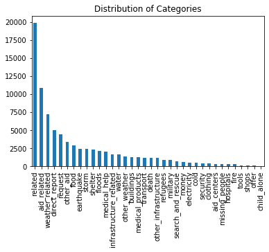
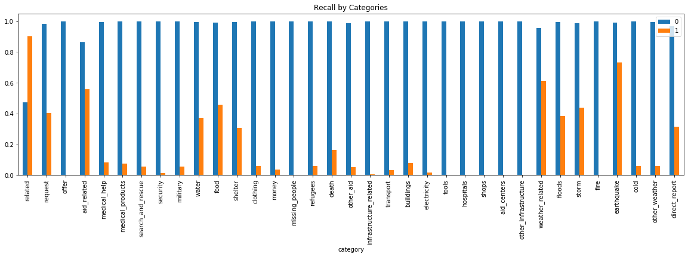

# Disaster Response Pipeline Project


### Project structure:
```
- app
| - template
| |- master.html  # index page template
| |- go.html      # classification results page
|- run.py         # Flask app

- data
|- disaster_categories.csv  # data to process
|- disaster_messages.csv    # data to process
|- process_data.py          # script implementing ETL pipeline
|- DisasterResponse.db      # database to save clean data to

- models
|- train_classifier.py      # script implementing ML pipeline
|- disaster_model.pkl       # pickled classification model

- dev
|- ETL Pipeline Preparation.ipynb # etl exploration
|- ML Pipeline Preparation.ipynb  # ML exploration

- README.md
```

### Required packages:

- flask
- joblib
- jupyter
- pandas
- plot.ly
- numpy
- scikit-learn
- sqlalchemy
- nltk

### Instructions:
1. Run the scripts in the project's root directory to prepare data and train the model:

    - ETL pipeline to cleans data and store results in database:
        `python data/process_data.py data/disaster_messages.csv data/disaster_categories.csv data/DisasterResponse.db`
    - ML pipeline to train classifier and save the model:
        `python models/train_classifier.py data/DisasterResponse.db models/disaster_model.pkl`

2. Run the script in the app's directory to start web app locally:
    `python run.py`

3. In any browser, go to http://127.0.0.1:3001/


### Data and ETL Pipeline details:

The data in this project comes from a modified version of the figure-eight [disaster response data](https://www.figure-eight.com/dataset/combined-disaster-response-data/).
They contain short messages labelled as one or several of 36 different categories related to disaster response.

_Extraction_:
Data are read from `data/disaster_messages.csv` and `data/disaster_categories.csv` files into pandas DataFrames, then merged into one DataFrame
_Transformation_:
Category labels are converted from texts into `0/1` encoding, duplicated rows are removed.
Below is the bar plot of distribution of messages by categories.

We can see that for most categories we have a very unbalanced distribution with too few positive examples.
_Loading_:
Cleaned data are saved into `sqlight` database.

### ML Pipeline details:
_Vectorization:_
Message texts are tokenized:
- text normalized (de-capitalized, only letters and digits left);
- split into words;
- stop words removed;
- remaining words are lemmatized and stemmed.

Lists of tokens are converted in vectors using TF-IDF vectorizer.

_Model Training:_
Data set is splitted into **Train** and **Test** subsets. Train subset is used to train a multi-label classifier. Initially, the **Random Forest** classifier with  was tried, the hyperparameters selection was done by `GridSearchCV`. The fitted model was scored on both **Train** and **Test** subsets.
It appears that this approach leads to:
- Severe overfitting (average accuracy 0.25 on Test vs 0.87 on Train data);
- Strong disbalance between scores for positive and negative examples (due to training data structure: too few positive samples for many categories).

As an illustration of the second statement, below is the bar graph of recall scores for all categories: positive (red bars) vs negative (blue bars) samples


To alleviate the problem of overfitting, the number of features was reduced by using **Truncated SVD**. Several attempts showed that **KNN Classifier** works best with these truncated features set.

The further improvement may include the weighting of positive/negative samples to address under-representation of positive samples.

### Web Application.

On main page it shows an overview of Training Dataset:
- Message Text Length Distribution;
- Percentage of Messages in English vs Translated Messages;
- Distribution of Messages by Categories.

Also it provides the UI to input a sample message and apply the trained model to get the classification results.


